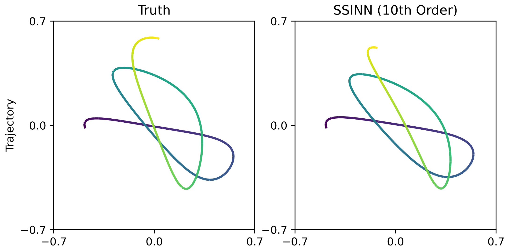

# Sparse Symplectically Integrated Neural Networks

Daniel DiPietro, Shiying Xiong, Bo Zhu (2020)

*Paper*: https://arxiv.org/abs/2006.12972

## Summary

Sparse Symplectically Integrated Neural Networks (SSINNs) are a novel model for learning Hamiltonian dynamical systems from data. SSINNs combine fourth-order symplectic integration with a learned parameterization of the Hamiltonian obtained using sparse regression through a mathematically elegant function space. This allows for interpretable models that incorporate symplectic inductive biases and have low memory requirements. SSINNs often successfully converge to true governing equations from highly limited and noisy data.

## Usage

Each folder contains a corresponding `data.py`, which generates the necessary dataset in the working directory, and `train.py`, which trains the SSINN on the given dataset. If the dataset is not in the directory when `train.py` is executed, it will call `data.py` and generate the dataset.

## Dependencies
* PyTorch
* NumPy
